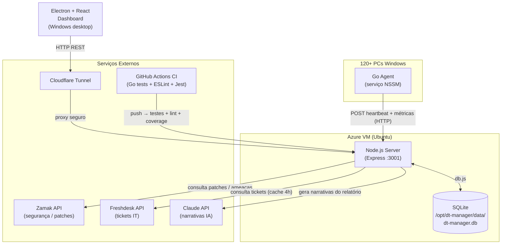
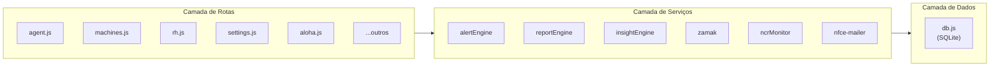

# Arquitetura — Delirio Manager

O Delirio Manager é um sistema de monitoramento de parque de TI composto por um agente Go instalado em cada PC Windows, um servidor Node.js hospedado em VM Azure e um dashboard Electron/React para visualização e gestão. Toda a comunicação entre o dashboard e o servidor ocorre via Cloudflare Tunnel, sem portas abertas na VM. Um banco SQLite centralizado persiste todos os dados de máquinas, métricas, tickets e configurações.

## Diagrama Geral

## Camadas do Servidor

